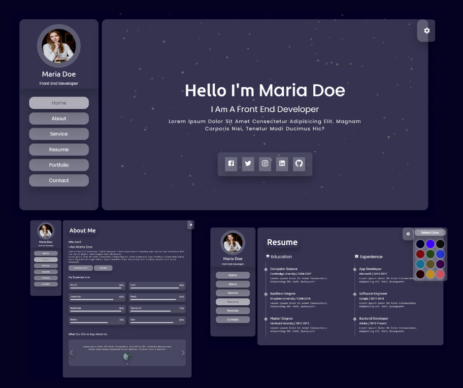

# 📚 Learning Project — Unix Glassmorphism React Portfolio ✨

> ⚡ **Note:**  
> This is a **learning project** created during my journey of learning React. I built this multi-page portfolio website to practice React concepts, modern UI techniques, and incorporate fun features like a theme switcher and Glassmorphism design.

## 📌 Overview

This is a **multi-page React-based portfolio website** built with a **Glassmorphism design** and features a **theme switcher** that allows users to toggle between **9 different background colors**. This project was created as part of my **learning phase** to experiment with modern web design and React libraries.

## 📌 Pages & Features

- 🏠 **Home** — Introduction and main portfolio landing page with an animated typewriter effect
- 👩‍💼 **About** — Personal introduction with professional background
- 🛠️ **Services** — A list of services I offer and skills I possess
- 📄 **Resume** — Education, experience, and skills timeline
- 🎨 **Portfolio** — A gallery of my projects with **Swiper slider** for easy viewing
- ✉️ **Contact** — A simple contact form and contact details

## 🎨 Glassmorphism Design

- **Glassmorphism** UI effect with smooth glass-like transparency
- A modern and minimalistic design trend with **CSS backdrop-filter** and blur effects

## 🎨 Theme Color Switcher

- **9 different color themes** to switch the background for fun
- Users can choose their preferred background theme by toggling a button

## 🚀 Technologies Used

- **React** `^17.0.2`
- **React Router DOM** `^5.2.0` for page navigation
- **Material-UI** `^4.12.2` (Core & Icons) for UI components
- **React Simple Typewriter** for typewriter text effect
- **Swiper JS** `^6.8.0` for responsive sliders in the portfolio section
- **React Particles JS** `^3.5.3` for animated background effects
- **Tsparticles** for enhanced particle animation
- **Node Sass** for advanced styling with SCSS
- **CSS Glassmorphism** effects for modern UI design

## 📷 Screenshot



## 🛠️ How to Run

1. Install the required dependencies:

   ```bash
   npm install --legacy-peer-deps

   ```

2. Starting the development server

```bash
  npm start

3 .Open in your browser:
http://localhost:3000


```

## What I Learned

Setting up multi-page layouts in React with React Router DOM

Creating Glassmorphism UI designs with CSS backdrop-filter and transparency

Adding theme switchers for background color changes

Implementing typewriter effects for animated text with react-simple-typewriter

Using Swiper for smooth project image sliders and carousel effects

Adding particle animations for background effects with React Particles JS

Enhancing styling and responsiveness with Node Sass

## About This Project

I created this project as a learning experiment to dive deep into React, explore modern UI trends like Glassmorphism, and integrate interactive features like theme switching. This project allowed me to practice working with React components, CSS effects, and popular libraries such as React Router, Swiper, and Particles.js.
